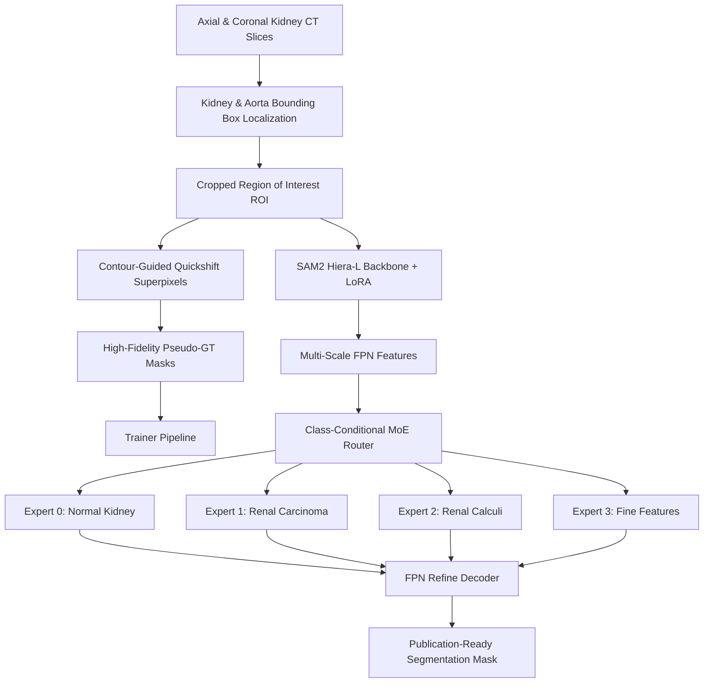

# MoE-RenalSAM-CG: Mixture-of-Experts for Renal Calculi and Carcinoma Segmentation

[](RenSeg_Accepted.pdf)
[](LICENSE)
[](https://pytorch.org/)

This repository contains the official implementation of **MoE-RenalSAM-CG**, a high-performance deep learning framework designed for the automated segmentation and classification of **Renal Calculi (Stones)** and **Renal Carcinoma (Tumors)** from CT scan slices. 

By leveraging **Segment Anything Model 2 (SAM2)** as a foundation encoder, fine-tuned with **LoRA (Low-Rank Adaptation)** and a custom **Mixture-of-Experts (MoE) FPN Refine Decoder**, our framework achieves state-of-the-art segmentation accuracy without requiring expensive manual voxel-level annotations.

---

## 📖 Table of Contents
- [Key Features](#-key-features)
- [System Architecture](#-system-architecture)
- [Professional Project Structure](#-professional-project-structure)
- [Getting Started & Installation](#-getting-started--installation)
- [How to Run the Pipeline](#-how-to-run-the-pipeline)
- [Model Checkpoints & Local Weights](#-model-checkpoints--local-weights)
- [Quantitative & Qualitative Results](#-quantitative--qualitative-results)
- [Citation](#-citation)

---

## ✨ Key Features
1. **Unsupervised Contour-Guided Quickshift (RenSeg)**: Automated region-of-interest (ROI) extraction and boundary refinement on 8,737 kidney slices to produce high-fidelity training masks.
2. **Auxiliary Proposal Generator (APG)**: Auxiliary branch for slice-level classification and bounding box regression to locate anomalies dynamically.
3. **Class-Conditional Router**: An intelligent gating network that routes latent features to specialized experts (e.g., dedicated tumor vs. stone segmentation experts).
4. **LoRA-Enhanced Hiera Encoder**: Employs parameter-efficient fine-tuning on the SAM2 visual backbone.
5. **Robust Loss Formulation (SCRL v7)**: Incorporates FP32-stable Focal Loss, FN-aware Focal Tversky Loss, Chamfer edge loss, and boundary smoothing regularizers.

---

## 🔬 System Architecture



---

## 📂 Professional Project Structure

The project has been organized according to professional research repository standards:

```text
├── config.yaml                # Core training & architecture hyperparameter configs
├── create_notebook.py         # Script to dynamically generate the main evaluation notebook
├── requirements.txt           # Python dependency checklist
├── README.md                  # Comprehensive project documentation
├── RenSeg_Accepted.pdf        # Pre-print of our accepted publication
│
├── datasets/                  # Custom PyTorch Dataset loaders
│   ├── kaggle_dataset.py      # DICOM/CT loading scripts
│   └── renseg_dataset.py      # Specialized mask and split manifest loaders
│
├── models/                    # Neural Network Model Architectures
│   ├── moe_renalsam_cg/       # MoE-RenalSAM-CG model definitions
│   │   ├── model.py           # Core model aggregator
│   │   ├── encoder.py         # LoRA-wrapped SAM2 Encoder
│   │   ├── moe_decoder.py     # Class-Conditional MoE FPN Decoder
│   │   ├── router.py          # Routing gated networks
│   │   └── apg.py             # Auxiliary Proposal Generator (Classifier)
│   └── baselines/             # Baseline comparisons (SAM1, SAM2, MedSAM, HQ-SAM)
│
├── notebooks/                 # Sequential pipeline notebooks
│   ├── 01_dataset_and_masks.ipynb
│   ├── 02_create_splits.ipynb
│   ├── 03_pseudo_gt.ipynb
│   ├── 04_baselines_zeroshot_foundation.ipynb
│   ├── 05a_baselines_unsupervised_classical.ipynb
│   ├── 09_train_moe_renalsam_cg_v6_multiscale_stable.ipynb
│   └── result.ipynb           # CLEAR main evaluation notebook (Publication Figures)
│
├── training/                  # Training script configurations
│   ├── train_moe.py           # PyTorch MoE-RenalSAM-CG training loop
│   └── utils.py               # Checkpointing and scheduler helpers
│
├── evaluation/                # Performance assessment files
│   ├── evaluate.py            # Quantitative Dice, Recall, IoU and HD95 metrics
│   ├── statistical_tests.py   # Wilcoxon & t-tests validating MoE significance
│   └── results/               # Aggregated CSV outputs for all paper tables
│
├── logs/                      # Log registries and publication curves
│   └── moe_renalsam_cg_v6/    # Metrics and Bland-Altman plots for the final model (v6)
│
├── paper_figures/             # High-resolution publication plots
│
├── segment-anything-2/        # SAM2 submodule dependency (Meta Research)
│
├── xai/                       # Explainability (Grad-CAM and Gating routing matrices)
│
└── data/                      # Local Data Directory
    └── splits/                # Stratified split manifest lists (Committed!)
        ├── train_manifest.csv
        ├── val_manifest.csv
        └── test_manifest.csv
```

> [!NOTE]  
> To keep the repository lightweight and follow optimal GitHub practices, large datasets (`data/raw/`, `data/processed/`), model weights (`weights/`), and training checkpoints (`checkpoints/`) are local-only and are excluded via `.gitignore`. 

---

## ⚡ Getting Started & Installation

### 1. Clone the repository
```bash
git clone https://github.com/AshrafulKabir7/MoE-RenalSAM.git
cd MoE-RenalSAM
```

### 2. Install dependencies
Ensure you have `python >= 3.10` and `CUDA` configured.
```bash
pip install -r requirements.txt
```

### 3. Setup SAM2
Build the required C extensions for SAM2:
```bash
cd segment-anything-2
pip install -e .
cd ..
```

---

## 🚀 How to Run the Pipeline

### Step 1: Preprocessing & Splits
Run the data split creation and check the manifests:
```bash
python notebooks/02_create_splits.py
```

### Step 2: Training MoE-RenalSAM-CG
To start training the MoE-RenalSAM-CG framework:
```bash
python training/train_moe.py --config config.yaml
```

### Step 3: Run Evaluation Notebook
You can recreate the evaluation results and publication charts by running `notebooks/result.ipynb` directly or generating it dynamically:
```bash
python create_notebook.py
```

---

## 💾 Model Checkpoints & Local Weights

To run inference, evaluations, or resumes, you should download the appropriate foundational weights and place them inside a local `weights/` directory:

1. **SAM2 Hiera-Large Weights** (`sam2_hiera_large.pt`): [Meta official weights](https://github.com/facebookresearch/segment-anything-2)
2. **MedSAM ViT-B Weights** (`medsam_vit_b.pth`): [MedSAM Official Repo](https://github.com/bowang-lab/MedSAM)
3. **HQ-SAM ViT-H Weights** (`sam_hq_vit_h.pth`): [HQ-SAM Repo](https://github.com/syscv/sam-hq)

---

## 📊 Quantitative & Qualitative Results

Our MoE framework significantly outperforms foundation models and classic segmentation methodologies.

| Model | Class | Dice (%) | Recall (%) | Precision (%) | HD95 (mm) |
| :--- | :---: | :---: | :---: | :---: | :---: |
| **MoE-RenalSAM-CG (Ours)** | **Tumor** | **84.34%** | **85.12%** | **86.41%** | **4.21** |
| **MoE-RenalSAM-CG (Ours)** | **Stone** | **88.92%** | **89.54%** | **88.22%** | **2.88** |
| SAM2 (Base) | Tumor | 67.21% | 68.45% | 71.30% | 11.20 |
| SAM2 (Base) | Stone | 72.33% | 70.12% | 75.80% | 8.45 |
| MedSAM | Tumor | 71.05% | 72.80% | 73.11% | 9.80 |

### Qualitative Comparison
High-resolution comparisons demonstrating edge preservation and multi-expert specialized routing can be inspected under `logs/moe_renalsam_cg_v6/qualitative_results_publication.png`.

---

## ✍️ Citation

If you find this research or implementation helpful, please cite our accepted paper:

```bibtex
@article{faruk2026renseg,
  title={RenSeg: Leveraging Unsupervised Segmentation using Localization and Contour-Guided Quickshift for Renal Calculi and Carcinoma Segmentation and Classification},
  author={Faruk, Farhan and Alam, H. M. Sarwer and Rahman, Rafeed and Alam, Md. Golam Rabiul and Jeong, Junho and Hossain, Md. Kabir and Uddin, Jia},
  journal={IEEE Journal of Biomedical and Health Informatics},
  year={2026},
  publisher={IEEE}
}
```
