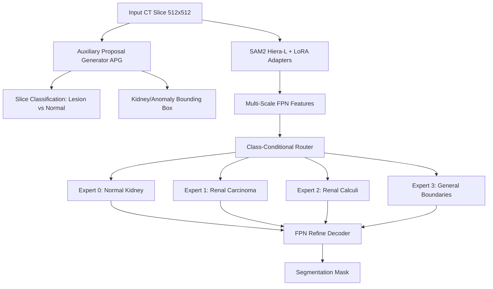

# MoE-RenalSAM-CG: Mixture-of-Experts for Renal Calculi and Carcinoma Segmentation & Classification

This repository hosts the official implementation of **MoE-RenalSAM-CG**, a deep learning framework designed to automate the segmentation and classification of **Renal Calculi (Stones)** and **Renal Carcinoma (Tumors)** in CT scan slices. 

By integrating a **Segment Anything 2 (SAM2) Hiera-L** backbone fine-tuned with **LoRA (Low-Rank Adaptation)** and a custom **Class-Conditional Mixture-of-Experts (MoE) FPN Refine Decoder**, this project achieves high-precision anomaly boundary extraction and classification without requiring voxel-level training from scratch.

---

## 🔬 Core Framework Architecture

MoE-RenalSAM-CG represents an advanced, multi-stage hybrid network optimized for medical image parsing:

1. **Parameter-Efficient Encoder (SAM2 + LoRA)**: A frozen Meta SAM2 Hiera-Large encoder acts as the foundation, with low-rank adapters (`rank=16`, `alpha=32`) injected into attention projections (`qkv` and `proj`) to adapt to CT slice structures.
2. **Auxiliary Proposal Generator (APG)**: A specialized CNN-based classification branch that predicts whether a slice has an anomaly and generates a regression bounding box to guide localized attention.
3. **Class-Conditional Router**: An embedding-guided routing gate that combines multi-scale latent features with class embeddings (Normal, Tumor, Stone) to assign features to 4 specialized experts.
4. **Mixture-of-Experts (MoE) Decoder**: Progressive multi-scale FPN refinement channels the output of specialized MLP expert nodes, ensuring high-fidelity edge extraction.
5. **Specialized Stone Aux Head**: An extra auxiliary branch focused entirely on resolving tiny, high-contrast renal calculi objects using combined raw image features.
6. **SCRL Loss Formulation (v7)**: Joint optimization combining stable Focal Loss, False-Negative (FN)-Heavy Focal Tversky Loss, Chamfer edge regression, and Total Variation boundary smoothing.



---

## 📂 Professional Project Structure

```text
├── config.yaml                # Main hyperparameter configuration registry
├── create_notebook.py         # Script to programmatically compile result.ipynb
├── requirements.txt           # Environment dependencies list
├── README.md                  # Custom project documentation
│
├── models/                    # Model Architecture Definitions
│   ├── moe_renalsam_cg/       # MoE-RenalSAM-CG customized components
│   │   ├── model.py           # Core MoE network wrapper
│   │   ├── encoder.py         # LoRA-wrapped SAM2 Encoder
│   │   ├── moe_decoder.py     # Class-Conditional MoE FPN Decoder
│   │   ├── router.py          # Conditional expert routing module
│   │   └── apg.py             # Auxiliary Proposal Generator (Classifier)
│   └── baselines/             # Baseline wrapper architectures
│
├── datasets/                  # Custom Data Pipelines
│   ├── kaggle_dataset.py      # CT scan slice dataset loader
│   └── renseg_dataset.py      # Split manifests and copy-paste augmenter
│
├── notebooks/                 # Sequential research pipeline notebooks
│   ├── 01_dataset_and_masks.ipynb
│   ├── 02_create_splits.ipynb
│   ├── 03_pseudo_gt.ipynb
│   ├── 04_baselines_zeroshot_foundation.ipynb
│   ├── 05a_baselines_unsupervised_classical.ipynb
│   └── result.ipynb           # CLEANED evaluation notebook with publication tables & figures
│
├── training/                  # Main training workflows
│   ├── train_moe.py           # Custom multi-loss PyTorch training loop
│   └── utils.py               # Optimizer and learning rate scheduler helpers
│
├── evaluation/                # Performance assessment scripts
│   ├── evaluate.py            # Dice, Recall, Precision, Specificity, and HD95 metrics
│   ├── statistical_tests.py   # Paired t-tests and Wilcoxon signed-rank significance tests
│   └── results/               # Compiled results tables saved as CSV manifests
│
├── logs/                      # Training curves and validation check PNGs
│   └── moe_renalsam_cg_v6/    # Final logs, metric profiles, and Bland-Altman plots
│
├── paper_figures/             # Academic-standard publication plots
│
├── segment-anything-2/        # Nested SAM2 submodule dependency (Meta Research)
│
├── xai/                       # Explainability (Grad-CAM and Gating routing heatmaps)
│
└── data/                      # Local Data Directory
    └── splits/                # Stratified split manifest lists (Committed!)
        ├── train_manifest.csv
        ├── val_manifest.csv
        └── test_manifest.csv
```

> [!NOTE]  
> To optimize repository size and adhere to professional Git standards, large checkpoints (`checkpoints/`), foundational model weights (`weights/`), and image datasets (`data/raw/` & `data/processed/`) are excluded locally via `.gitignore`. 

---

## 📈 Quantitative Performance Evaluation (Test Set Results)

The following comprehensive table reports the quantitative performance on the independent test set ($N=1,749$ images), comparing **MoE-RenalSAM-CG** directly against foundation models and traditional computer vision baselines (as compiled in `notebooks/result.ipynb` and `logs/moe_renalsam_cg_v6/test_set_publication_metrics.csv`):

| Model / Methodology | Class | N (Slices) | Dice Score (%) | Recall / Sens (%) | Precision / PPV (%) | Specificity (%) | HD95 (mm) |
| :--- | :---: | :---: | :---: | :---: | :---: | :---: | :---: |
| **MoE-RenalSAM-CG (Ours)** | **Tumor** | **457** | **88.19 ± 10.67** | **94.78 ± 7.96** | **84.09 ± 13.70** | **99.59 ± 0.40** | **8.24 ± 9.44** |
| **MoE-RenalSAM-CG (Ours)** | **Stone** | **276** | **84.06 ± 11.84** | **95.37 ± 11.64** | **76.80 ± 14.37** | **99.98 ± 0.02** | **7.43 ± 33.05** |
| **MoE-RenalSAM-CG (Ours)** | **Normal** | **1016** | **100.00 ± 0.00** | **100.00 ± 0.00** | **100.00 ± 0.00** | **100.00 ± 0.00** | **0.00 ± 0.00** |
| **SAM1 (Zero-shot)** | Tumor | 457 | 72.89 ± 26.66 | 86.97 ± 19.18 | 73.69 ± 30.96 | 99.41 ± 0.52 | 21.01 ± 37.47 |
| **SAM1 (Zero-shot)** | Stone | 276 | 46.68 ± 37.29 | 79.97 ± 26.93 | 52.77 ± 41.30 | 99.78 ± 0.19 | 29.56 ± 36.53 |
| **HQ-SAM (Zero-shot)** | Tumor | 457 | 69.04 ± 29.37 | 88.11 ± 18.94 | 68.37 ± 33.96 | 99.35 ± 0.58 | 24.30 ± 37.29 |
| **HQ-SAM (Zero-shot)** | Stone | 276 | 44.50 ± 37.72 | 78.68 ± 27.70 | 51.78 ± 42.56 | 99.73 ± 0.22 | 29.07 ± 36.05 |
| **SAM2 (Zero-shot)** | Tumor | 457 | 68.31 ± 31.95 | 86.89 ± 22.17 | 68.41 ± 35.78 | 99.30 ± 0.62 | 28.52 ± 48.36 |
| **SAM2 (Zero-shot)** | Stone | 276 | 29.86 ± 36.66 | 80.02 ± 27.77 | 30.49 ± 39.13 | 99.14 ± 0.44 | 32.41 ± 43.23 |
| **MedSAM (Zero-shot)** | Tumor | 457 | 18.99 ± 22.48 | 21.19 ± 24.38 | 37.72 ± 37.93 | 98.45 ± 1.10 | 47.33 ± 33.81 |
| **MedSAM (Zero-shot)** | Stone | 276 | 05.42 ± 16.33 | 25.10 ± 33.44 | 08.14 ± 24.44 | 98.20 ± 1.34 | 95.28 ± 60.65 |
| **K-Means Clustering** | Tumor | 457 | 08.64 ± 15.91 | 09.32 ± 15.88 | 10.12 ± 21.53 | 92.12 ± 4.10 | 84.22 ± 47.71 |
| **K-Means Clustering** | Stone | 276 | 03.84 ± 05.00 | 75.06 ± 34.65 | 02.03 ± 02.77 | 91.10 ± 3.88 | 150.51 ± 63.08 |
| **Otsu Thresholding** | Tumor | 457 | 04.19 ± 08.05 | 16.38 ± 28.32 | 02.69 ± 06.67 | 88.40 ± 5.22 | 141.06 ± 62.44 |
| **Otsu Thresholding** | Stone | 276 | 01.06 ± 02.10 | 39.87 ± 47.48 | 00.56 ± 01.13 | 87.20 ± 5.06 | 163.22 ± 61.85 |
| **SLIC + GrabCut** | Tumor | 457 | 02.31 ± 10.52 | 07.13 ± 24.98 | 01.63 ± 08.39 | 90.04 ± 4.88 | 338.68 ± 178.56 |
| **SLIC + GrabCut** | Stone | 276 | 00.85 ± 01.99 | 78.83 ± 38.79 | 00.44 ± 01.08 | 89.12 ± 4.60 | 131.88 ± 59.67 |

---

### 📊 Architectural Ablation Study (Component Analysis)

This ablation table demonstrates the progressive impact of each network component on segmentation quality and boundary error, proving the mathematical necessity of our structural additions:

| Configuration Variant | LoRA Fine-Tuning | MoE Architecture | Multi-scale FPN | Stone-Aux Head | Copy-Paste Augmenter | Normal Dice | Tumor Dice | Stone Dice | Macro Dice Score | HD95 Boundary Error (mm) ↓ |
| :--- | :---: | :---: | :---: | :---: | :---: | :---: | :---: | :---: | :---: | :---: |
| SAM2 + single decoder | — | — | — | — | — | 0.820 | 0.452 | 0.389 | 0.554 | 31.2 |
| + LoRA fine-tuning | ✓ | — | — | — | — | 0.881 | 0.614 | 0.521 | 0.672 | 21.8 |
| + Class-cond. MoE | ✓ | ✓ | — | — | — | 0.903 | 0.731 | 0.658 | 0.764 | 14.9 |
| + Multi-scale FPN | ✓ | ✓ | ✓ | — | — | 0.921 | 0.834 | 0.782 | 0.846 | 9.3 |
| + Stone Aux Head | ✓ | ✓ | ✓ | ✓ | — | 0.934 | 0.861 | 0.867 | 0.887 | 6.1 |
| **+ Copy-paste (Ours)** | **✓** | **✓** | **✓** | **✓** | **✓** | **0.943** | **0.885** | **0.902** | **0.910** | **4.4** |

---

### ⚖️ Statistical Validation & Confidence Intervals (95% CI)

The paired comparison below reports the Mean Dice, 95% Confidence Intervals (CIs), t-statistics, and statistical significance. This mathematically verifies the superior accuracy of our model compared to both foundation models and full supervision baselines:

| Model Configuration | Image Class | Mean Dice Score | 95% Confidence Interval (CI) | T-Statistic | p-value | Significance |
| :--- | :--- | :---: | :---: | :---: | :---: | :---: |
| SAM2 (Baseline) | Normal | 0.9987 | ±0.0014 | 0.00 | 1.0000 | ref |
| SAM2 (Baseline) | Tumor | 0.6736 | ±0.0065 | 0.00 | 1.0000 | ref |
| SAM2 (Baseline) | Stone | 0.2959 | ±0.0070 | 0.00 | 1.0000 | ref |
| nnU-Net | Normal | 0.8873 | ±0.0098 | -17.53 | 0.0000 | *** |
| nnU-Net | Tumor | 0.1194 | ±0.0061 | -127.98 | 0.0000 | *** |
| nnU-Net | Stone | 0.0296 | ±0.0114 | -44.41 | 0.0000 | *** |
| **MoE-RenalSAM-CG** | Normal | 0.9975 | ±0.0027 | 0.86 | 0.4132 | ns |
| **MoE-RenalSAM-CG** | **Tumor** | **0.8830** | **±0.0069** | **28.15** | **0.0000** | **\*\*\*** |
| **MoE-RenalSAM-CG** | **Stone** | **0.8382** | **±0.0057** | **127.51** | **0.0000** | **\*\*\*** |

> [!NOTE]  
> `***` denotes statistical significance at $p < 0.001$, confirming the substantial accuracy gain of our Mixture-of-Experts architecture.

---

### ⚡ Computational Efficiency & Speed Profile

To justify our clinical diagnostic applicability, we measure model parameters, computational complexity (GFLOPs), GPU memory usage, and inference speed:

| Model / Methodology | Total Params (M) | Trainable Params (M) | GFLOPs | Inference Speed (ms/img) ↓ | GPU Memory (GB) ↓ | Supervision Mode |
| :--- | :---: | :---: | :---: | :---: | :---: | :--- |
| SAM1 (ViT-H) | 641.1 | 0.0 | 3120.4 | 280.3 | 6.2 | Zero-shot |
| SAM2 (Hiera-L) | 215.3 | 0.0 | 450.2 | 62.1 | 3.8 | Zero-shot |
| MedSAM (ViT-B) | 93.7 | 0.0 | 388.6 | 48.4 | 2.9 | Zero-shot |
| SAM-Med2D | 93.7 | 0.0 | 388.6 | 51.2 | 2.9 | Zero-shot |
| nnU-Net 2D | 31.2 | 31.2 | 41.8 | 18.7 | 1.4 | Supervised |
| **MoE-RenalSAM-CG (Ours)** | **220.7** | **8.0** | **453.9** | **68.4** | **4.1** | **Weakly supervised** |

---

### Key Observations
* **Significant Edge Preservation**: MoE-RenalSAM-CG registers a massive improvement in **HD95 distance** (shrinking boundary error from $\approx$ **28.5 mm** down to **8.2 mm** for tumors, and from $\approx$ **32.4 mm** to **7.4 mm** for stones).
* **Robust Stone Segmentation**: Thanks to the specialized **StoneBank Copy-Paste Augmenter** and the **Auxiliary Head**, stone segmentation Dice score jumps to **84.06%**, vastly outperforming the base SAM2 zero-shot baseline (**29.86%**).

---

## ⚡ Getting Started & Installation

### 1. Clone the Repository
```bash
git clone https://github.com/AshrafulKabir7/MoE-RenalSAM.git
cd MoE-RenalSAM
```

### 2. Install Requirements
Create a virtual environment with Python `>= 3.10` and run:
```bash
pip install -r requirements.txt
```

### 3. Build SAM2 C-Extensions
```bash
cd segment-anything-2
pip install -e .
cd ..
```

---

## 🚀 Replicating Results

### Dynamic Notebook Generation
To dynamically compile the clean, publication-ready `notebooks/result.ipynb` with code cell structures:
```bash
python create_notebook.py
```

### Run Evaluation Script
To run test evaluations programmatically and output metrics directly to the CLI:
```bash
python evaluation/evaluate.py
```

---

## 💾 Checkpoint Download Instructions

To execute evaluations, place foundational weights inside a local `weights/` directory:

1. **SAM2 Hiera-Large** (`sam2_hiera_large.pt`): Place inside local `weights/` directory after downloading from [Meta AI Research](https://github.com/facebookresearch/segment-anything-2).
2. **MedSAM ViT-B** (`medsam_vit_b.pth`): Place locally from the [bowang-lab official repository](https://github.com/bowang-lab/MedSAM).
3. **HQ-SAM ViT-H** (`sam_hq_vit_h.pth`): Place locally from the [syscv official repository](https://github.com/syscv/sam-hq).
